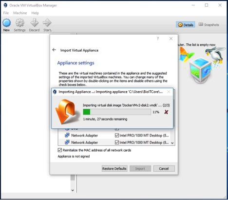
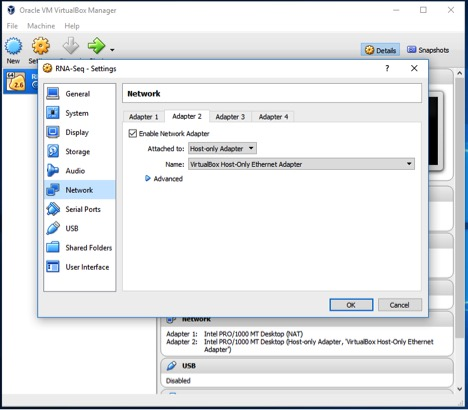
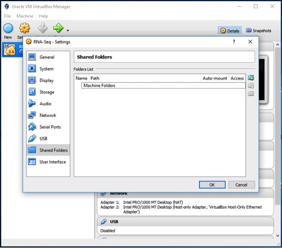
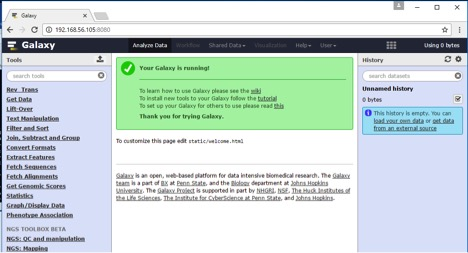
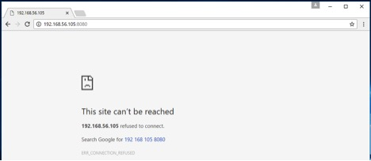

TED Virtual Machine (VM)
========================

How to run the TED toolkit Virtual Machine (VM) Application

Pre-requisites
--------------
Download VirtualBox: http://www.virtualbox

Setting up TED VM Application
-----------------------------

Downdload TED VM files from Galaxy Data Libraries
^^^^^^^^^^^^^^^^^^^^^^^^^^^^^^^^^^^^^^^^^^^^^^^^^
Galaxy Data Libraries link: http://galaxy.hunter.cuny.edu/library/list#folders/Fb56e686e7a485784

.. image:: ted_vm.jpg
   :align: center

Select Appliance on VM
^^^^^^^^^^^^^^^^^^^^^^
.. image:: importvm.jpg
   :align: center

Import OVA Appliance on VM
^^^^^^^^^^^^^^^^^^^^^^^^^^
.. image:: appliancevm_import.jpg
   :align: center

TED Appliance settings for import on VM
^^^^^^^^^^^^^^^^^^^^^^^^^^^^^^^^^^^^^^^
.. image:: appliancevm.jpg
   :align: center

TED Appliance Importing on VM
^^^^^^^^^^^^^^^^^^^^^^^^^^^^^^^^^^^^^^^

TED Appliance Settings on VM
-----------------------------

Go to Settings
^^^^^^^^^^^^^^
.. image:: settings.jpg
   :align: center

System Requirements
^^^^^^^^^^^^^^^^^^^

Open virtual disk file for TED Appliance on VM

.. image:: boot2docker.jpg
   :align: center

Network
^^^^^^^

Setup Adapter 1

.. image:: network.jpg
   :align: center

Setup Adapter 2

Shared Folders
^^^^^^^^^^^^^^

Setup Adapter 1

Connecting TED Appliance on VM
------------------------------

Go to Settings
^^^^^^^^^^^^^^
.. image:: boot2dockerterm.jpg
   :align: center

Broad casted Galaxy instance IP address
^^^^^^^^^^^^^^^^^^^^^^^^^^^^^^^^^^^^^^^

.. image:: connectinggalaxy.jpg
   :align: center

Web Browser connection of Galaxy instance on VM
^^^^^^^^^^^^^^^^^^^^^^^^^^^^^^^^^^^^^^^^^^^^^^^

How to access TED toolkit on VM
-------------------------------

TED VM Troubleshoot
-------------------

Galaxy instance IP address unreachable
^^^^^^^^^^^^^^^^^^^^^^^^^^^^^^^^^^^^^^

Reinitialize TED appliance
^^^^^^^^^^^^^^^^^^^^^^^^^^

.. image:: troubleshoot.jpg
   :align: center

Reconnect Galaxy instance IP address on web browser
^^^^^^^^^^^^^^^^^^^^^^^^^^^^^^^^^^^^^^^^^^^^^^^^^^^

